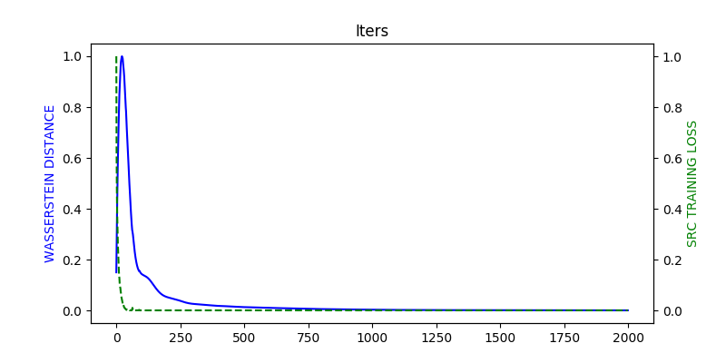

# WDGRL
### INTRODUCTION
Wasserstein Distance Guided Representation Learning
was inspired by GAN, which utilizes a neural network, denoted by the
domain critic, to estimate empirical Wasserstein distance between
the source and target samples and optimizes the feature
extractor network to minimize the estimated Wasserstein distance
in an adversarial manner.
### HOW TO USE
```python
    ux, uy = parse_data()
    usps_data = load_usps(ux, uy, validation_size=5000, test_size=0)
    mnist_data = load_mnist(one_hot=True, validation_size=5000)
    x_original = mnist_data.dataset.validation._images
    wdgrl = WDGRL(input_dim=784, gp_param=10, training_steps=2000, D_train_steps=20)
    wdgrl.fit(data_src=usps_data, data_tar=mnist_data, draw_plot=True)
    x_new = wdgrl.transform(x_original)
```
### VISUALIZATION

### REFERENCE
[1] Shen J, Qu Y, Zhang W, et al. Wasserstein Distance Guided Representation Learning for Domain Adaptation[J]. 2018.
### CONCAT
pyk3350266@163.com